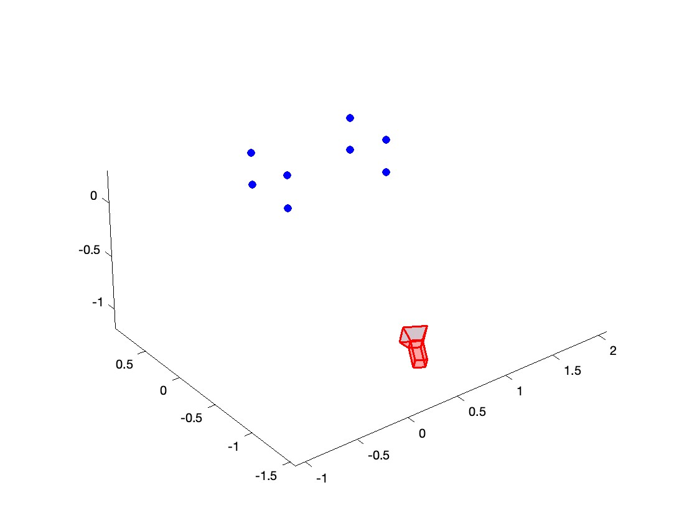

# IACV-Homework-24-25

Welcome to the **IACV-Homework-24-25** repository! This project involves **image analysis and computer vision techniques** to reconstruct a 3D scene from a given image.

## 📌 Project Objective
The goal of this project is to extract and compute key geometric properties from the image scene, including:
- Determining the **vanishing line** (*l′∞*) of the horizontal plane.
- Computing the **Euclidean rectification mapping** (*HR*) and the **depth (m)** of the parallelepiped.
- Estimating the **camera calibration matrix (K)**.
- Measuring the **height (h)** of the parallelepiped.
- Extracting the **X-Y coordinates** of a dozen points on surface *S*.
- Determining the **camera’s location in world coordinates**.

## 📁 Repository Structure
- **code/** - Implementation of the algorithms and computations.
- **images/** - Reference images used in the analysis.
- **docs/** - Full report and additional documentation.
- **README.md** - This file.

## 📸 Reconstructed Scene

## 📜 Full Report
For a detailed breakdown of the methodology, computations, and results, check the [full report here](Report/Bardelli-Lorenzo-Reprot.pdf) available in the `docs/` folder.

---
Feel free to explore the repository and contribute with suggestions or improvements!
